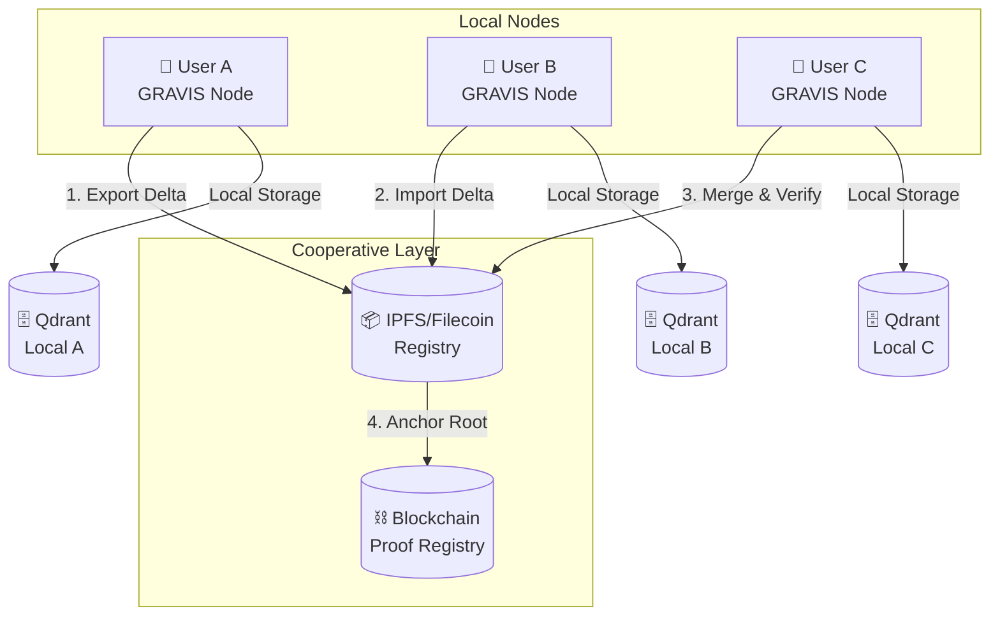

# GCEL - Gravis Cooperative Embedding Layer
## 🧠 A Decentralized Knowledge Fabric for the AI Age

*Roadmap & Technical Specifications v0.1*

## 🎯 1. CONCEPT & STRATEGIC VISION

### Vision Statement
**Réinventer la collaboration cognitive.**

Le protocole GCEL transforme les espaces d'embeddings (vecteurs IA) en mémoires collectives signées, vérifiables et synchronisables, permettant à plusieurs utilisateurs ou agents de partager leur savoir sans serveur central.

> *"Comme Git pour le code, GCEL est Git pour les connaissances vectorisées."*

### Problème Identifié

Aujourd'hui :
- **Fragmentation** : Les données IA sont fragmentées, centralisées et opaques
- **Duplication** : Chaque organisation refait le même travail de vectorisation
- **Opacité** : Les embeddings n'ont ni traçabilité, ni interopérabilité
- **Isolation** : Le partage de savoirs vectoriels est inexistant ou non vérifiable

### Solution GCEL

**GCEL = une couche de collaboration décentralisée sur les embeddings**

- ✅ Chaque sandbox GRAVIS est une base RAG locale append-only
- ✅ Chaque contribution est signée, vérifiée, et horodatée
- ✅ Les échanges se font via bundles portables (PRB) ou réseau P2P/IPFS
- ✅ Les versions (epochs) sont liées par un Merkle DAG et peuvent être ancrées on-chain

→ **Résultat** : Créer, partager et auditer des mémoires d'IA souveraines

## 🧩 2. ARCHITECTURE CONCEPTUELLE

### Diagramme de Flux



### Composants Principaux

| Concept | Description |
|---------|-------------|
| 🧩 **Sandbox** | Espace vectoriel partagé (Qdrant + manifest + signatures) |
| 🕒 **Epoch** | Version incrémentale du sandbox, hashée et signée |
| 🔐 **Delta Bundle (PRB)** | Lot d'ajouts signés, exportable et vérifiable |
| 🌐 **Bridge** | Transport : fichier, IPFS, Filecoin, P2P |
| 🧠 **Merge** | Fusion automatique de contributions (Union, LWW, etc.) |
| ⛓️ **On-chain Proof** | Ancrage du merkle_root pour preuve publique |

### Avantages Compétitifs

| Avantage | Détail |
|----------|--------|
| **Souveraineté totale** | Aucune donnée sur un serveur externe |
| **Offline-first** | Fonctionne même sans connexion |
| **Traçabilité cryptographique** | Chaque ajout est signé, vérifiable |
| **Interopérabilité RAG/LLM** | Compatible Qdrant, Chroma, FAISS, LlamaIndex |
| **Économie du savoir** | Les sandboxes deviennent des actifs échangeables |
| **Scalabilité humaine** | Collaboration asynchrone entre IA, humains et agents |

## 🎯 3. CAS D'USAGE STRATÉGIQUES

### Secteurs Cibles

| Secteur | Exemple d'Application |
|---------|----------------------|
| **R&D & Industrie** | Partage d'embeddings techniques signés entre laboratoires |
| **Éducation / e-learning** | Cours, notes et résumés indexés et synchronisés |
| **Entreprise / KM** | Mémoire collective des équipes avec traçabilité |
| **Open Source / Recherche** | Datasets vectorisés audités et reproductibles |
| **États / Gouvernance IA** | IA souveraines avec mémoires certifiées et locales |

### Modèle Économique Potentiel

| Axe | Description |
|-----|-------------|
| **Licence souveraine** | Plateforme GRAVIS PRO avec gestion multi-nœuds |
| **Marketplace** | Vente ou partage de sandboxes signés |
| **Registry on-chain** | Index global de bundles vérifiés (Proof-of-Knowledge) |
| **API B2B** | Synchronisation entre entités privées (entreprises, institutions) |

### Positionnement Stratégique

| Élément | GCEL |
|---------|-----|
| **Périmètre** | Infrastructure cognitive décentralisée |
| **Comparables** | Git / HuggingFace / LangChain / Filecoin |
| **Différenciateur** | Signatures + Versioning + Offline-first + IA-ready |
| **Type d'innovation** | Deeptech : IA × Web3 × Knowledge Federation |

## 🔧 4. SPÉCIFICATION TECHNIQUE - GCEL Protocol v0.1

### Overview

**GCEL (Gravis Cooperative Embedding Layer)**
Protocole de synchronisation, versioning et vérification pour embeddings distribués.

- **Architecture** : append-only Merkle DAG
- **Transport** : file, IPFS, Filecoin, P2P
- **Crypto** : Ed25519 signatures, Blake3 hashing
- **Optionnel** : anchoring via EVM chain (Merkle root commit)

#### Protocol Versioning Roadmap

| Version | Capability | Status |
|---------|------------|--------|
| **v0.1** | Local sandbox + export/import | 🚧 In Development |
| **v0.2** | Network sync (IPFS/Filecoin) | ⏳ Planned Q2 2024 |
| **v0.3** | On-chain registry + proofs | ⏳ Planned Q3 2024 |
| **v1.0** | Federation layer / GCEL Network | 🎯 Target Q4 2024 |

### Entités Principales

| Élément | Description |
|---------|-------------|
| **Sandbox** | Espace vectoriel identifiable (space_id) |
| **Epoch** | État versionné du sandbox (hashé et signé) |
| **Delta** | Ensemble d'ajouts entre deux epochs |
| **Contributor** | Identité cryptographique (pubkey Ed25519) |
| **Manifest** | Métadonnées du sandbox (chronologie, auteurs, roots) |

### Structures de Données

#### manifest.json
```json
{
  "space_id": "sandbox_clients",
  "epochs": [
    {
      "epoch": 41,
      "merkle_root": "0xabc123",
      "signer_pubkey": "ed25519:lucas",
      "timestamp": 1731420000,
      "on_chain": null
    },
    {
      "epoch": 42,
      "merkle_root": "0xdef456",
      "signer_pubkey": "ed25519:remi",
      "timestamp": 1731430000,
      "on_chain": { 
        "chain_id": 8453, 
        "tx_hash": "0xdeadbeef..." 
      }
    }
  ]
}
```

#### delta_entry.ndjson
```json
{
  "op": "Upsert",
  "document_id": "doc:report-07",
  "chunk_id": "c0001",
  "vector_digest": "e3ab...",
  "payload_digest": "9f0c...",
  "nonce": "b64...",
  "merkle_leaf": "0x44aa...",
  "leaf_sig": "ed25519:MEUCIQ..."
}
```

## ⚙️ 5. PROCESSUS OPÉRATIONNELS

### Flux Standard

#### 1️⃣ Création Locale
```
sandbox_upsert() → compute leaf hashes → build Merkle → sign root
```

#### 2️⃣ Export
```
export_delta_bundle(base_epoch, new_epoch)
→ génère .tar.zst (manifest.json + delta.ndjson + proofs/)
→ option : encrypt(passphrase) + upload(IPFS/Filecoin)
```

#### 3️⃣ Import
```
import_delta_bundle()
→ vérifie parent_root + signature + proofs
→ upsert Qdrant + update manifest
→ merge si epochs divergents
```

#### 4️⃣ Merge
```
merge_epochs(epochA, epochB)
→ union des chunks + nouveau Merkle root + signature du mergeur
```

### Sécurité & Intégrité

| Niveau | Mécanisme |
|--------|-----------|
| **Chunk** | hash blake3(content+meta) |
| **Delta** | Merkle root des chunks |
| **Epoch** | signature Ed25519 du root |
| **History** | chaînage parent_root → child_root |
| **Réseau** | optional on-chain anchoring (Merkle root commit) |

### Transport Bridges

| Type | Implémentation | Description |
|------|---------------|-------------|
| **File Bridge** | .gravis-rag.tar.zst | Simple fichier portable |
| **IPFS Bridge** | ipfs://CID | Publication P2P décentralisée |
| **Filecoin Bridge** | deal_id | Stockage vérifié longue durée |
| **P2P Bridge** | WebRTC/libp2p | Synchronisation directe entre GRAVIS |
| **S3 Bridge** | Presigned URLs | Option Cloud privé sécurisé |

### Résilience & Multi-Bridge Replication

- **Redondance** : Un sandbox peut être répliqué sur plusieurs bridges simultanément
- **Fallback** : Si IPFS est indisponible, fallback automatique vers P2P local ou S3
- **Sync Strategy** : Priorité IPFS > P2P > File > S3 selon disponibilité réseau
- **Integrity Check** : Vérification Merkle sur chaque bridge avant import

### Merge Policies

| Policy | Description |
|--------|-------------|
| **Union** | Ajoute tous les nouveaux embeddings |
| **LastWriterWins** | Remplace les doublons les plus anciens |
| **SkipExisting** | Ignore si déjà présent |
| **Replace** | Supprime avant ajout |

## 🔗 6. COMPATIBILITÉ & INTÉGRATIONS

### Stack Technique
- **Embedders** : CustomE5, OpenAI, HuggingFace, Ollama
- **Vector stores** : Qdrant, Chroma, FAISS
- **Frameworks** : LangChain, LlamaIndex, Haystack
- **Frontend** : GRAVIS UI / Tauri
- **Hash** : BLAKE3 (fast, cryptographically secure)

### Interopérabilité Future

#### Adapters & Extensions
- **LangChain Adapter** : `GCELVectorStore` pour intégration directe
- **LlamaIndex Integration** : Support natif des sandboxes GCEL
- **Ollama Plugin** : Contextualisation automatique via sandboxes partagés
- **Mistral/Claude API** : Injection de contexte vectoriel coopératif

#### Standards & APIs
- **REST API** : Endpoints standardisés pour interrogation cross-platform
- **GraphQL Schema** : Queries flexibles sur métadonnées et embeddings
- **OpenAPI Spec** : Documentation auto-générée pour intégrations tierces

### On-chain Extension (Optionnelle)

#### Smart Contract Minimal (Solidity)
```solidity
event RootCommitted(string spaceId, uint256 epoch, bytes32 root, address signer);

function commitRoot(string calldata spaceId, uint256 epoch, bytes32 root) external;

function verifyRoot(string calldata spaceId, bytes32 root) external view returns(bool);
```

- **Chaîne suggérée** : Base / Filecoin / Arbitrum Orbit
- **Objectif** : Vérifier publiquement la cohérence d'un sandbox

### API Tauri Commands

| Commande | Rôle |
|----------|------|
| `export_space_bundle()` | Crée un delta signé |
| `import_space_bundle()` | Vérifie et applique un delta |
| `merge_epochs()` | Fusionne deux branches |
| `verify_epoch()` | Vérifie signature + Merkle proofs |
| `push_to_bridge()` | Upload vers IPFS/Filecoin |
| `pull_from_bridge()` | Récupère et vérifie |

## 🗓️ 7. ROADMAP DE DÉVELOPPEMENT

### Phase 1 - PoC Local Cooperative Sandbox
**Objectif** : Export/import signés  
**Délivrable** : GRAVIS v1 avec fonctionnalités de base  
**Timeline** : Q1 2024

#### Fonctionnalités
- ✅ Signature Ed25519 des epochs
- ✅ Export/import de bundles .tar.zst
- ✅ Vérification cryptographique
- ✅ Merge basique (Union policy)

### Phase 2 - IPFS/Filecoin Registry
**Objectif** : Publication décentralisée  
**Délivrable** : CID partagé et récupération P2P  
**Timeline** : Q2 2024

#### Fonctionnalités
- 🔄 Bridge IPFS intégré
- 🔄 Publication automatique des bundles
- 🔄 Discovery des sandboxes publics
- 🔄 Chiffrement optionnel des données

### Phase 3 - On-chain Anchoring
**Objectif** : Merkle root on-chain  
**Délivrable** : Badge "verified knowledge"  
**Timeline** : Q3 2024

#### Fonctionnalités
- ⏳ Smart contract de registry
- ⏳ Commits automatiques sur Base/Arbitrum
- ⏳ Vérification publique des epochs
- ⏳ Réputation des contributeurs

### Phase 4 - Federation Layer
**Objectif** : Réseau de sandboxes coopératifs  
**Délivrable** : GCEL Network complet  
**Timeline** : Q4 2024

#### Fonctionnalités
- ⏳ Synchronisation automatique P2P
- ⏳ Résolution de conflits avancée
- ⏳ API Federation pour entreprises
- ⏳ Governance décentralisée des sandboxes

#### Governance Coopérative

**Configuration par Sandbox** (`gcel.config`)
```yaml
sandbox_id: "research-lab-ai"
governance:
  roles:
    maintainers: ["ed25519:lucas", "ed25519:remi"]
    contributors: ["ed25519:*"]
    verifiers: ["ed25519:alice", "ed25519:bob"]
  policies:
    merge_strategy: "consensus"  # union | lww | consensus
    whitelist_mode: true
    min_verifications: 2
    auto_sync: false
economics:
  proof_of_knowledge: enabled
  reputation_weight: true
  access_tokens: ["premium", "academic"]
```

**Rôles & Permissions**

| Rôle | Permissions |
|------|-------------|
| **Maintainer** | Merge, govern, configure policies |
| **Contributor** | Submit deltas, propose changes |
| **Verifier** | Validate contributions, sign proofs |
| **Consumer** | Read-only access, query embeddings |

**Micro-DAO Concept**
> *"Chaque sandbox peut devenir une micro-DAO de connaissance avec ses propres règles de gouvernance et mécanismes de consensus."*

## 🎯 8. ÉTAPES IMMÉDIATES

### Priorités Techniques
1. **Implémentation Rust/Tauri** — Export/import + merge + verify
2. **CLI GCEL** — `gravis sync`, `gravis verify`, `gravis merge`
3. **Bridge IPFS/Filecoin** — Partage public des sandboxes
4. **Documentation API** — Spécifications complètes pour développeurs

### Livrables Court Terme
- [ ] PoC fonctionnel de signature/vérification
- [ ] Interface UI pour export/import
- [ ] Tests unitaires du protocole
- [ ] Documentation développeur complète

### Future Work & Research

#### Proof-of-Knowledge (PoK)
**Concept** : Authentifier la production d'embeddings sans divulguer les données sources

- **Challenge** : Prouver qu'un utilisateur a réellement généré des embeddings à partir d'un contenu spécifique
- **Solution** : Protocole ZK-proof basé sur les métadonnées de vectorisation
- **Application** : Certification de datasets, lutte contre le plagiat vectoriel
- **Timeline** : Recherche exploratoire post-v1.0

#### Knowledge Economics
- **Tokenomics** : Modèles d'incitation pour contribution de qualité
- **Reputation Systems** : Scoring basé sur la valeur des embeddings partagés
- **Access Control** : Monétisation fine-grained des sandboxes premium

---

## 📄 Annexes

### Références
- [Git Protocol](https://git-scm.com/book/en/v2/Git-Internals-Transfer-Protocols)
- [IPFS Specifications](https://docs.ipfs.tech/concepts/)
- [Merkle DAG](https://docs.ipfs.tech/concepts/merkle-dag/)
- [Ed25519 Signatures](https://ed25519.cr.yp.to/)

### Glossaire
- **Epoch** : Version immuable et signée d'un sandbox
- **Delta Bundle** : Package de modifications entre deux epochs
- **Merkle DAG** : Structure de données permettant la vérification d'intégrité
- **Bridge** : Mécanisme de transport des données entre nœuds
- **Sandbox** : Espace vectoriel isolé et versionné
- **PoK** : Proof-of-Knowledge, preuve cryptographique de génération d'embeddings
- **GCEL Network** : Réseau fédéré de sandboxes coopératifs
- **Cooperative Layer** : Infrastructure décentralisée pour partage de savoirs vectorisés

---

*Document généré le 12 novembre 2024*  
*Version : 0.1 - Draft initial*